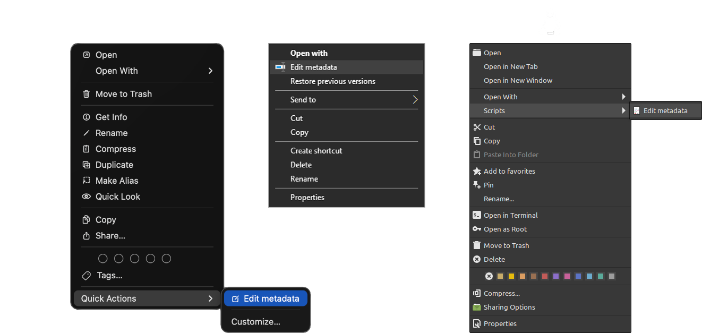

<div align="center">

# metmux

**Interactive, multi-format, command-line metadata editor with right-click integration.**

**Status: stable (v1.0.0).** Validated by a 525-test bench, property-based fuzzing included.

**100% local: no network, no telemetry.**

**Compatible with: Windows, macOS, Linux.**

[Why](#why) · [Installation](#installation) · [Usage](#usage) · [Configuration](#configuration-configjson) · [Supported formats](#supported-formats) · [Architecture](#architecture) · [Development](#development) · [Roadmap](#roadmap) · [Credits](#credits) · [License](#license)

</div>

metmux is a Python program that lets you edit the metadata of a wide variety of files through a TUI (an interactive interface in the terminal).

Its name is a contraction of *metadata multiplexer*: *met* for metadata, its core business; *mux* for multiplexer, the system that picks the right specialised engine (exiftool, ffmpeg, mutagen…) according to the file type.

Its goal is practicality: it launches with a simple right-click on any file(s) or folder(s). It is a single tool where several would normally be needed, in a language that is literal and quick to use.

<div align="center">
  
</div>

---

## Why

While tidying up my archives, I started looking for open-source software for my specific needs. For duplicates, I found the excellent Czkawka/Krokiet. For backups, FreeFileSync (or rsync). Perfect.

But well-sorted files are one thing; well-documented ones are better. In quite a few cases my metadata was wrong or missing (photos, music, documents…). That is when I went looking for metadata-editing software, and I ended up with several tools, some with an interface, some without.

I wrote scripts to automate some actions, which took up my time and still left me frustrated with the end result. I could not understand why no single piece of software let you do all of this at once.

The building blocks (the engines) were already there, so I ended up creating an interface to talk to them: that is how metmux was born.

No more clutter, everything within reach, in one right-click. It was exactly what I had wanted from the start, and I suspect I may not be the only one.

So I extended the features beyond that initial use to turn it into a product useful to anyone interested.

### The existing tools, and their limits

To frame what metmux replaces, here is what already existed: two families of tools, each with its own constraints.

**(a) Visual interface:** one program per family, to stack up.


<table>
  <thead>
    <tr>
      <th align="center">Family</th>
      <th align="center">Proprietary</th>
      <th align="center">Free</th>
    </tr>
  </thead>
  <tbody>
    <tr>
      <td align="center"><strong>Photos / Images</strong></td>
      <td>Lightroom (~$12/month), Bridge, Photo Mechanic (~$149/year)</td>
      <td>digiKam, ExifToolGUI (Windows only), jExifToolGUI (discontinued 2023)</td>
    </tr>
    <tr>
      <td align="center"><strong>PDF</strong></td>
      <td>Acrobat Pro (~$20/month)</td>
      <td>—</td>
    </tr>
    <tr>
      <td align="center"><strong>Audio</strong></td>
      <td>Mp3tag (paid on Mac), dBpoweramp (~$48)</td>
      <td>Kid3, MusicBrainz Picard</td>
    </tr>
    <tr>
      <td align="center"><strong>Video</strong></td>
      <td>MetaX (Windows, ~$20)</td>
      <td>MKVToolNix (MKV only), Subler (MP4 + macOS only)</td>
    </tr>
    <tr>
      <td align="center"><strong>Office</strong></td>
      <td>Microsoft Office</td>
      <td>LibreOffice</td>
    </tr>
    <tr>
      <td align="center"><strong>EPUB</strong></td>
      <td>—</td>
      <td>Calibre, Sigil</td>
    </tr>
    <tr>
      <td align="center"><strong>Comics CBZ</strong></td>
      <td>—</td>
      <td>ComicTagger</td>
    </tr>
    <tr>
      <td align="center"><strong>MusicXML scores</strong></td>
      <td>—</td>
      <td>MuseScore</td>
    </tr>
    <tr>
      <td align="center"><strong>Geo (KMZ, GeoJSON)</strong></td>
      <td>Google Earth</td>
      <td>QGIS</td>
    </tr>
    <tr>
      <td>ipynb, plist, eml, mbox, har, sqlite, m3u, cue, tcx, webloc…</td>
      <td colspan="2"><em>No mainstream editor: hand editing or developer tools</em></td>
    </tr>
  </tbody>
</table>


> Constraints: several programs to install, master and maintain, fragmented by format and OS. And for a whole range of formats, no coverage at all. These programs often offer far more than metadata editing, which makes them heavy for that single need.

**(b) Command-line tools:** a distinct syntax for each.

Examples for editing a title:

- **exiftool**: `exiftool -Title="My title" photo.jpg`
- **ffmpeg**: `ffmpeg -i in.mp4 -metadata title="My title" -c copy out.mp4`
- **mutagen**: `audio = EasyID3("song.mp3"); audio["title"] = "My title"; audio.save()`

> Constraints: mastering the syntax, and knowing which one to call depending on the extension.

### What metmux brings

metmux:
1. Provides a visual interface without a GUI.
2. Launches with a right-click on any file(s) or folder(s) from the file manager.
3. Adopts a unified, literal and quick language.
4. Combines the different engines invisibly according to the extension (photos, music, video, documents, EPUB…).
5. Edits internal and external metadata at once.
6. Offers extra options: full wipe, batch editing, date shifting…

All of it cross-platform (Windows, macOS, Linux) and free: a single entry point that makes all these engines accessible to everyone.

---

## Installation

### What you need

<table>
  <thead>
    <tr>
      <th align="center">Tool</th>
      <th align="center">Why</th>
      <th align="center">Required?</th>
    </tr>
  </thead>
  <tbody>
    <tr>
      <td><strong>Python 3.8+</strong></td>
      <td>runs the program</td>
      <td align="center">✓ yes</td>
    </tr>
    <tr>
      <td><strong>exiftool</strong></td>
      <td>images, PDF, and the dates of all files</td>
      <td align="center">✓ yes</td>
    </tr>
    <tr>
      <td><strong>ffmpeg / ffprobe</strong></td>
      <td>video containers (MKV, AVI, WebM…)</td>
      <td align="center">⟡ recommended</td>
    </tr>
    <tr>
      <td><strong>mutagen</strong> (Python module)</td>
      <td>audio files (MP3, FLAC…)</td>
      <td align="center">⟡ recommended</td>
    </tr>
  </tbody>
</table>

The "recommended" tools unlock the video and audio formats. The formats handled by the Python stdlib (Office, EPUB, eml, sqlite, ipynb…) work without them.

### Install the tools

**Two families of tools, different installations:**

- **Standalone programs**: `exiftool` and `ffmpeg`.
- **Python module**: `mutagen`.

The simplest way on all three systems: a package manager (winget on Windows, Homebrew on macOS, apt on Linux). It downloads the program, puts it in the right place and sets the PATH for you.

**Windows** — with winget, the package manager built into Windows 10 and 11. Windows does not ship Python: the first line installs it (skip it if you already have it):
```sh
winget install -e --id Python.Python.3.12
winget install -e --id OliverBetz.ExifTool
winget install -e --id Gyan.FFmpeg
pip3 install mutagen
```
<details>
<summary>Without winget — manual installation</summary>

1. **Python**: on python.org, download the installer and run it, ticking "Add python.exe to PATH".
2. Create `C:\Tools` or any other stable folder.
3. **ExifTool**: on exiftool.org, download the archive, extract it, rename `exiftool(-k).exe` to `exiftool.exe`, and place it in `C:\Tools\exiftool`.
4. **ffmpeg**: on ffmpeg.org, click the Windows icon to download the archive, extract it, copy the `bin` subfolder into `C:\Tools\ffmpeg`. Result: `C:\Tools\ffmpeg\bin\ffmpeg.exe` (with `ffprobe.exe`). The rest of the archive is not needed.
5. Add these folders to the PATH: search bar → "Edit the system environment variables" → *Environment Variables* → select `Path` → *Edit* → *New* → type `C:\Tools\exiftool`. Do *New* again for `C:\Tools\ffmpeg\bin`. Confirm with *OK*.
6. **mutagen**: `pip3 install mutagen` in the console.
---
</details>

**macOS** — with [Homebrew](https://brew.sh):
```sh
brew install exiftool ffmpeg
pip3 install mutagen
```

<details>
<summary>Without Homebrew — manual installation or MacPorts</summary>

1. **ExifTool**: on exiftool.org, download the `.pkg` and double-click it. It installs into `/usr/local/bin`, already in the PATH: nothing else to do.
2. **ffmpeg**: on ffmpeg.org, click the macOS icon to download the archive, and extract it: you get a file named `ffmpeg`. In the terminal, type `sudo mkdir -p /usr/local/bin && sudo mv ~/Downloads/ffmpeg /usr/local/bin/` then your password. This creates the `/usr/local/bin` folder, only if it does not already exist, and moves ffmpeg into it.
3. **mutagen**: `pip3 install mutagen` in the terminal.

Alternative via **[MacPorts](https://www.macports.org)** (another package manager): `sudo port install exiftool ffmpeg`, then step 3.

---
</details>

**Linux** — with your distribution's package manager.

**Debian / Ubuntu**:
```sh
sudo apt install libimage-exiftool-perl ffmpeg python3-mutagen
```

**Fedora** — the full `ffmpeg` requires RPM Fusion (enabled first):
```sh
sudo dnf install \
  https://download1.rpmfusion.org/free/fedora/rpmfusion-free-release-$(rpm -E %fedora).noarch.rpm \
  https://download1.rpmfusion.org/nonfree/fedora/rpmfusion-nonfree-release-$(rpm -E %fedora).noarch.rpm
sudo dnf install perl-Image-ExifTool ffmpeg python3-mutagen
```

**Arch**:
```sh
sudo pacman -S perl-image-exiftool ffmpeg python-mutagen
```

### Get the program

[`metmux.py`](metmux.py) is a single file, but launching via right-click also needs the scripts in the [`integrations/`](integrations/) folder. The simplest way is therefore to get the whole repository.

- **Without git**: green "Code" button at the top of the page → "Download ZIP", then extract the archive.
- **With git**, same command on Windows, macOS and Linux:

```sh
git clone https://github.com/michaelbruzy/metmux
cd metmux
```

**Well done, metmux is installed**. One last step remains: installing the right-click (recommended usage), explained step by step for Windows, macOS and Linux in [integrations/README.md](integrations/README.md).

<div align="center">
  
</div>


> Terminal use only? [`metmux.py`](metmux.py) is enough, or install the `metmux` command with pip. Everything is gathered in [In the terminal](#open-metmux-in-the-terminal) further down.

---

## Usage

### Launch metmux

With the right-click, you have no setting to specify: metmux adapts automatically to what you have selected.

- **A single file**: you edit that file.
- **Several files**: metmux first asks what you want. `g` edits the batch at once (group mode), `s` edits file by file (keyboard arrows ← / → or `n`/`p` to navigate). The choice is never final: `s` and `g` switch between the two during the session (see [the commands](#the-commands)).
- **A folder**: you edit the files directly inside it, not the subfolders (non-recursive processing).

### The three views and the visual code

metmux starts on the `edit` view.
> Fully read-only formats (mbox, tcx, application packages) open on `all`, since nothing there is editable.

You change view by typing its name:

<table>
  <thead>
    <tr>
      <th align="center">View</th>
      <th align="center">What it shows</th>
    </tr>
  </thead>
  <tbody>
    <tr>
      <td align="center"><kbd>all</kbd></td>
      <td>all fields</td>
    </tr>
    <tr>
      <td align="center"><kbd>in</kbd></td>
      <td>only the fields with a value</td>
    </tr>
    <tr>
      <td align="center"><kbd>edit</kbd></td>
      <td>only the editable fields (with or without a value)</td>
    </tr>
  </tbody>
</table>

The visual code shows whether the fields are editable or not:

- **Bold white** = editable field (may be empty or filled).
- Medium grey = read-only / non-editable field.

### During a session

At the prompt, you type either a field to edit, or a command. Commands and field names are case-insensitive (`q`, `Q`, `artist`, `ARTIST`); only the values you write keep exactly the case you typed.

#### Rewrite a field:

To edit a field, just rewrite it.

<table>
  <thead>
    <tr><th colspan="2" align="center">You can write...</th></tr>
  </thead>
  <tbody>
    <tr><td><code>Title : Sunset</code></td><td>the label, with a colon</td></tr>
    <tr><td><code>Title:Sunset</code></td><td>colon stuck on (the spaces around it are free)</td></tr>
    <tr><td><code>Title Sunset</code></td><td>without a colon (a space is enough)</td></tr>
    <tr><td><code>title : Sunset</code></td><td>without a capital</td></tr>
    <tr><td><code>t : Sunset</code></td><td>the alias (the one shown in parentheses)</td></tr>
    <tr><td><code>t Sunset</code></td><td>the alias without a colon (<strong>the fastest ←</strong>)</td></tr>
  </tbody>
</table>

> It is also possible to rename the file via the "file name" field. metmux refuses the characters `/`, `\`, `%`, control characters, an empty name, a name starting with a dot (hidden file), a name reserved by the OS (`CON`, `NUL`…) or a name already taken.

#### Clear a field:

Just write the field alone, followed by a colon or simply a space, with the same combinations as above. The idea is that an empty field is a cleared field.
Examples: `Title :`, `t `, etc.

#### Paste a value:

Type the field name first, paste, then Enter.
To guard against accidental pasting, a paste on an empty line is refused, and the first word of a pasted text is never read as a field name.

Examples:
`field : (paste "a long time ago...")` → The field takes the value of the pasted block.
`(paste "a long time ago...")` → The paste is refused, and the "a" is not recognised as the `a` of the `artist` field.

#### Clear the line:

`Ctrl-U` erases the whole input at once.

#### Append without overwriting:

List fields (Keywords, Subject, Category, etc.) accept a "+" in front of the value, which appends instead of overwriting:

`Keywords +vacation` ← adds "vacation" to the keywords already present.

> **Good to know for all fields:**
> A value (time, URL, etc.) may contain a ":". Example: `title : Trombone Concerto: III`

#### Dates:

Dates can be edited separately, or all at once via the `dates` command.
Example: `dates 25/12/2024 14:00`.

This command acts on the file's timestamps, except the file system's creation date and access date, as well as the dates of the *work* (an album's year, `originaldate`, a film's or a book's date, etc.). The work's dates remain editable individually, as does the creation date (macOS and Windows only). The access date is never editable: the system rewrites it on every read.

##### Recognised formats:

`2024` · `2024/12` · `12/2024` · `25/12/2024` · `2024/12/25` · `25/12/2024 14:00` · `25/12/2024 14:00:30` · `20241225` · `202412251400` · `20241225140000`

The separator is free: `/`, `-`, `.` or `:` for the date, and `:`, `h`, `m` or `s` for the time, on all the formats [listed above](#recognised-formats).

Examples: `25-12-2024` · `25/12/2024 14h00m30s`

##### Day/month order:

By default, metmux reads *and displays* dates in European format ("`eu`"): `25/12/2024` = December 25. For the American order, type `us` in the program (`12/25/2024`). The choice is saved immediately in `config.json` and kept for the following sessions.

##### Shift a date:

It is also possible to shift a date, or all of them: a "+" or a "-" followed by a duration in days (d), hours (h), minutes (m) or seconds (s).

Examples:
- `dates +2h` or `dates -1d`: shifts all the timestamps targeted by `dates` (+2 hours, −1 day).
- `FileModifyDate +1d2h`: shifts that single date (+1 day and 2 hours).

In a batch, each file is shifted from its own value.

##### Rules to know:

On the file's timestamps, whatever is not specified is filled in at the lowest: 1st day and 1st month, time at `00:00:00`.
Example: `dates 2024` will apply the date `2024/01/01 00:00:00`.

A 2-digit year reads as 20xx: `25/12/24` = `25/12/2024`.

#### Batch editing:

On a batch of files, the common values are merged, and those that differ from one file to another show as `***`. Any input then applies to all the files at once. The one exception is renaming: unavailable in a batch (every file would get the same name).

Example on a whole album:
```
Artist (a) : Sergei Rachmaninoff
Title (t) : ***
```

#### The commands:

<table>
  <thead>
    <tr>
      <th align="center">Command</th>
      <th align="center">Effect</th>
    </tr>
  </thead>
  <tbody>
    <tr>
      <td align="center"><kbd>help</kbd></td>
      <td>shows the help</td>
    </tr>
    <tr>
      <td align="center"><kbd>all</kbd> / <kbd>in</kbd> / <kbd>edit</kbd></td>
      <td>changes view (<a href="#the-three-views-and-the-visual-code">see above</a>)</td>
    </tr>
    <tr>
      <td align="center"><kbd>s</kbd> / <kbd>single</kbd></td>
      <td>in group mode: takes the batch back file by file</td>
    </tr>
    <tr>
      <td align="center"><kbd>g</kbd> / <kbd>group</kbd></td>
      <td>in a file-by-file walk: returns to editing the whole batch at once</td>
    </tr>
    <tr>
      <td align="center"><kbd>→</kbd> / <kbd>←</kbd></td>
      <td>batch walk: next / previous file, without Enter, when the input line is empty</td>
    </tr>
    <tr>
      <td align="center"><kbd>n</kbd> / <kbd>p</kbd></td>
      <td>the same walk, typed as a command then Enter: next file (<code>n</code>, as in <em>next</em>) / previous (<code>p</code>, as in <em>previous</em>)</td>
    </tr>
    <tr>
      <td align="center"><kbd>Ctrl-U</kbd></td>
      <td>erases the line being typed at once</td>
    </tr>
    <tr>
      <td align="center"><kbd>fr</kbd> / <kbd>en</kbd></td>
      <td>changes the display language (saved in <code>config.json</code>)</td>
    </tr>
    <tr>
      <td align="center"><kbd>eu</kbd> / <kbd>us</kbd></td>
      <td>changes the order of ambiguous dates: <code>eu</code> = day/month, <code>us</code> = month/day (saved)</td>
    </tr>
    <tr>
      <td align="center"><kbd>dates …</kbd></td>
      <td>writes or shifts the dates (see above)</td>
    </tr>
    <tr>
      <td align="center"><kbd>wipe</kbd></td>
      <td>erases all metadata (undoable)</td>
    </tr>
    <tr>
      <td align="center"><kbd>u</kbd> / <kbd>undo</kbd></td>
      <td>undoes the last change</td>
    </tr>
    <tr>
      <td align="center"><kbd>ua</kbd> / <kbd>undo all</kbd></td>
      <td>undoes all the changes of the session</td>
    </tr>
    <tr>
      <td align="center"><kbd>q</kbd> / <kbd>quit</kbd> / <kbd>exit</kbd></td>
      <td>quits</td>
    </tr>
  </tbody>
</table>

> The batch commands (`s`, `g`, `→`/`←`, `n`/`p`) only exist with several files.

> `wipe` asks for confirmation if several files are processed at the same time.

#### Undo:

Any change applies immediately and stays undoable (`u`, `ua`) for the duration of the session, including after moving to another file of the batch or switching group/individual. A change is no longer undoable once metmux is closed.

> ⚠ Exception for undoing a `wipe` on an **audio, video or image** file: the undo restores the textual fields, but **not** the embedded binary elements (cover art, per-track metadata, chapters; embedded thumbnail and maker notes for images). metmux flags this at the moment of the `wipe`.
>
> On a **PDF**, `wipe` neutralises the metadata but exiftool cannot physically remove it: it remains technically recoverable inside the file. metmux also flags this at the moment of the `wipe`.

#### Focus:

On a single file. Typing the name of a field alone (example: `lyrics`), without a value or a trailing space, shows its full value, which the list truncates. If it is an embedded image (thumbnail, album cover…), metmux opens it in your viewer.

<details>
<summary><h3>Open metmux in the terminal</h3></summary>

Right-click remains the usage `metmux` was designed for, but everything is also accessible on the command line: what the right-click chooses automatically according to the selection becomes an explicit setting there, via `--mode`.

1. **Get [`metmux.py`](metmux.py) alone**:
   - **Without git**: download the single [`metmux.py`](metmux.py) file via the "Download raw file" icon.
   - **With git**: `git clone https://github.com/michaelbruzy/metmux` (gets the whole repository; only `metmux.py` is used here).
   - **With [pipx](https://pipx.pypa.io)**: `pipx install metmux` installs the `metmux` command (mutagen included) in an isolated environment, the recommended way for a command-line tool. Otherwise `pip3 install metmux` installs it into your current Python environment.

2. **Launch metmux** on one or more files, choosing the mode:

```sh
python3 metmux.py --mode=MODE [file or folder ...]
```

Example:
```sh
python3 metmux.py --mode=single my_photo.jpg
```

Installed via pip, replace `python3 metmux.py` with `metmux`: the command is on the PATH.

Four possible values for `MODE`:
- `single`: opens a file-by-file session.
- `group`: opens a single session that edits the whole batch at once.
- `ask`: with several files, asks first: `single` or `group` (what the right-click integrations use); with a single file, opens the normal session directly.
- `wipe`: one-shot mode, empties the whole batch without opening a session; the result shows on a summary screen, where undo (`u` / `ua`) is still offered.

3. **Help and version**: `--version` (or `-V`) prints the version, `--help` (or `-h`) recalls the syntax.

> The `--gather` option (used by the Windows integration) merges near-simultaneous launches into a single session: the Windows context menu starts one metmux per selected file, and this is how they end up in a single window. It is useless in a normal terminal session.

> The protected paste ([see above](#paste-a-value)) has a single exception: a terminal without *bracketed paste* (bare Linux text console, very old tmux/screen). Paste values there line by line: without that feature, a pasted multi-line block could run its first line as a command. All modern terminals have it; the classic Windows console does not, but there metmux reads the keyboard itself and the protection holds without it.

</details>

---

## Configuration (`config.json`)

`config.json` keeps the preferences from one session to the next: the language and the date format.

No need to touch it or to create it: it writes itself when you type `fr`/`en` or `eu`/`us` in the program, and if it is missing or damaged, metmux starts on its default settings.

```json
{
  "lang": "en",
  "date_format": "eu"
}
```

- `lang` (`"en"` or `"fr"`): the language at startup.
- `date_format` (`"eu"` or `"us"`): the day/month order, applied both to the reading of an ambiguous date you type and to the display of any date. `"eu"` puts the day first (`25/12/2024`), `"us"` the month first (`12/25/2024`).
> Note: for each setting, the first value listed is the default.

---

## Supported formats

<table>
  <thead>
    <tr>
      <th align="center">Category</th>
      <th align="center">Formats</th>
      <th align="center">Engine</th>
      <th align="center">Editing</th>
    </tr>
  </thead>
  <tbody>
    <tr>
      <td>Images, PDF, misc</td>
      <td>jpg, jpeg, tiff, tif, png, gif, webp, heic, heif, cr2, cr3, nef, arw, dng, orf, rw2, raf, pdf (+ any other format recognized by exiftool, read-only when exiftool cannot write it)</td>
      <td align="center">exiftool</td>
      <td>read + write</td>
    </tr>
    <tr>
      <td>Audio</td>
      <td>mp3, flac, ogg, oga, opus, ape, wv, mpc, tta, ofr</td>
      <td align="center">mutagen</td>
      <td>read + write</td>
    </tr>
    <tr>
      <td>Audio (tags read-only)</td>
      <td>wma, aiff, aif</td>
      <td align="center">mutagen</td>
      <td>read-only (name and file dates stay editable)</td>
    </tr>
    <tr>
      <td>Video (containers)</td>
      <td>mkv, avi, flv, wmv, asf, webm, mka</td>
      <td align="center">ffmpeg</td>
      <td>read + write</td>
    </tr>
    <tr>
      <td>Office</td>
      <td>docx, xlsx, pptx, odt, ods, odp</td>
      <td align="center">stdlib</td>
      <td>read + write</td>
    </tr>
    <tr>
      <td>Books / notebooks</td>
      <td>epub, ipynb</td>
      <td align="center">stdlib</td>
      <td>read + write</td>
    </tr>
    <tr>
      <td>Comics</td>
      <td>cbz</td>
      <td align="center">stdlib</td>
      <td>read + write</td>
    </tr>
    <tr>
      <td>Playlists</td>
      <td>m3u, m3u8</td>
      <td align="center">stdlib</td>
      <td>read + write</td>
    </tr>
    <tr>
      <td>Cue sheet</td>
      <td>cue</td>
      <td align="center">stdlib</td>
      <td>read + write</td>
    </tr>
    <tr>
      <td>Property lists</td>
      <td>plist, webloc, mobileconfig</td>
      <td align="center">stdlib</td>
      <td>read + write</td>
    </tr>
    <tr>
      <td>E-mail</td>
      <td>eml</td>
      <td align="center">stdlib</td>
      <td>read + write</td>
    </tr>
    <tr>
      <td>Mailbox</td>
      <td>mbox</td>
      <td align="center">stdlib</td>
      <td>read-only</td>
    </tr>
    <tr>
      <td>Geo</td>
      <td>geojson, kmz</td>
      <td align="center">stdlib</td>
      <td>read + write</td>
    </tr>
    <tr>
      <td>Web</td>
      <td>har</td>
      <td align="center">stdlib</td>
      <td>read (+ comment)</td>
    </tr>
    <tr>
      <td>Databases</td>
      <td>sqlite, sqlite3, db</td>
      <td align="center">stdlib</td>
      <td>read + write (app id, version)</td>
    </tr>
    <tr>
      <td>Scores</td>
      <td>musicxml</td>
      <td align="center">stdlib</td>
      <td>read + write</td>
    </tr>
    <tr>
      <td>Sports activities</td>
      <td>tcx</td>
      <td align="center">stdlib</td>
      <td>read-only</td>
    </tr>
    <tr>
      <td>Application packages</td>
      <td>jar, war, ear, apk, xpi, ipa</td>
      <td align="center">stdlib</td>
      <td>read-only</td>
    </tr>
  </tbody>
</table>

> Why application packages are read-only: an app (Android .apk, iOS .ipa, Java .jar…) embeds a digital signature proving it has not changed since it was built. The system verifies it at install time. Modifying the file, even a single piece of metadata, breaks that signature: the app would be refused as corrupted. metmux therefore reads them without ever writing to them.

For the formats absent from this table, metmux edits at least the external metadata: the name and the dates held by the file system.

**Editable whatever the format and the system:**

<table>
  <thead>
    <tr>
      <th align="center">Field</th>
      <th align="center">What it is</th>
    </tr>
  </thead>
  <tbody>
    <tr>
      <td><code>FileName</code></td>
      <td>the rename (same safeguards: no <code>/</code>, <code>\</code>, <code>%</code>, nor an empty or reserved name)</td>
    </tr>
    <tr>
      <td><code>FileModifyDate</code></td>
      <td>the <code>mtime</code> timestamp of the file system</td>
    </tr>
  </tbody>
</table>

**Operating-system dependent:**

<table>
  <thead>
    <tr>
      <th align="center">Field</th>
      <th align="center">Availability</th>
    </tr>
  </thead>
  <tbody>
    <tr>
      <td>Creation date</td>
      <td>Editable on macOS and Windows, written by metmux with no external tool. On Linux, no userspace API allows writing a creation date: it is read-only there. Shown only where the file system keeps one (macOS and Windows; Linux does not expose one).</td>
    </tr>
    <tr>
      <td>Access date</td>
      <td>Read-only: any read of the file updates it, rewriting it would have no effect.</td>
    </tr>
  </tbody>
</table>

An unknown type or a corrupted file is never edited as content: metmux refuses it ("Cannot read file.") or falls back to its external data only (name, file dates).

### Add a format

Is a format missing? Two options:

- **Ask for it**: open an *issue* (a public message on the repository's page, meant to report a need or a bug) describing the format, with a sample file if possible.
- **Code it**: one format = one small "engine" to plug into the routing (see [Architecture](#architecture)). You then propose its addition via a *pull request* (a proposal to modify the code).

---

## Architecture

`metmux` fits in **a single file** ([`metmux.py`](metmux.py)), organised in three layers:

- **Routing by extension** (`engine_for`): the file's extension chooses the engine; everything that has no dedicated engine goes to **exiftool**, which covers images, PDF and a great many other types.
- **A table of engines** (`ENGINES`): each engine exposes the **same contract of four functions** `read` / `write` / `writable` / `wipe`. Three rely on an external tool (exiftool, mutagen, ffmpeg); **seventeen** use only Python's **standard library**.
- **Shared logic**, common to all engines: reading and writing dates, safeguards on field names, and the on-screen visual code.

Adding a format comes down to writing such an engine and registering it in `ENGINES`, without touching the rest; each engine is proven by the test suite (next section).

**A write never modifies the file in place**: whatever the engine, metmux writes a complete temporary file next to the original, then renames it over it. An interruption therefore never leaves a half-written file; in exchange, each validated field costs a full rewrite, and as much free space as the file's size for the duration of the operation.

---

## Development

The bench builds its own test files: no real file is touched. Tests that require a missing tool are skipped.

```sh
pip3 install pytest mutagen hypothesis
HYPOTHESIS_STORAGE_DIRECTORY=/tmp/hypothesis python3 -B -m pytest tests/ -p no:cacheprovider
```

Fully green = the contract encoded in [`tests/metmux_test.py`](tests/metmux_test.py) is met. Any added feature must first receive its own assertions in the bench.

The bench includes **property-based fuzzing** (Hypothesis): rather than fixed examples, it generates hundreds of tortured inputs (unicode, control characters, empty or oversized values) and checks that no function raises an exception or corrupts a file. By default, the fast search (parsers, readers, stdlib writes) runs on every execution. For a deeper campaign, which adds end-to-end writing via exiftool/ffmpeg/mutagen, prefix the same command with `FUZZ=300`:

```sh
FUZZ=300 HYPOTHESIS_STORAGE_DIRECTORY=/tmp/hypothesis python3 -B -m pytest tests/ -p no:cacheprovider
```

### A repo that stays clean

All the settings fit on the line, there is no configuration file at the root. Each option neutralises an artifact, so that the suite leaves **nothing** behind it:

<table>
  <thead>
    <tr>
      <th align="center">Option</th>
      <th align="center">Effect</th>
    </tr>
  </thead>
  <tbody>
    <tr>
      <td><code>python3 -B</code></td>
      <td>no <code>__pycache__/</code> bytecode (<code>.pyc</code>)</td>
    </tr>
    <tr>
      <td><code>-p no:cacheprovider</code></td>
      <td>no <code>.pytest_cache/</code> pytest cache</td>
    </tr>
    <tr>
      <td><code>HYPOTHESIS_STORAGE_DIRECTORY=/tmp/hypothesis</code></td>
      <td>Hypothesis's example database and caches (<code>.hypothesis/</code>) sent outside the repository</td>
    </tr>
    <tr>
      <td><a href="tests/"><code>tests/</code></a></td>
      <td>collection limited to the tests folder only</td>
    </tr>
  </tbody>
</table>

Always run the suite with this full command: a plain `python3 -m pytest` would reintroduce these folders at the root.

---

## Roadmap

metmux v1.0.0 is stable and self-sufficient. The avenues below are being considered for the future, with no commitment on date or scope:

- **Metadata copy / paste:** memorise the fields of one file and apply them to another, directly from the right-click.
- **Targeted "privacy" wipe:** remove only the identifying fields (GPS, author, software, device…) while keeping title and description.
- **Multi-OS installer:** a single script that puts the right-click integrations in the right place, without manual editing of paths.
- **Grouped writes:** apply several fields in a single rewrite of the file, faster on very large files.

An idea, a need? Open an *issue* on the repository.

---

## Credits

`metmux` could not exist without the tools it relies on:

- [**ExifTool**](https://exiftool.org) by Phil Harvey: Artistic / GPL license;
- [**FFmpeg**](https://ffmpeg.org): LGPL license (some options GPL);
- [**Mutagen**](https://github.com/quodlibet/mutagen): GPL-2.0-or-later license.

Thanks to their authors. These tools keep their license, are not included in the repository, and are installed separately (see [Installation](#installation)).

---

## License

[GNU GPL v3.0 or later](LICENSE) © 2026 Michaël Bruzy.

`metmux` is free software under the GPL-3.0-or-later license: you may use, study, modify and redistribute it, including for commercial purposes, on the sole condition that any distributed derivative also remains under the GPL, with its source code open.
